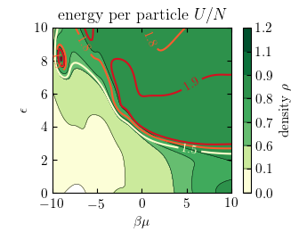

# Simple examples

### Random forest

### ANN

#### Fitting two variables at once

#### Fitting variables in 2d
|  |  |
|:--:|:--:|
| Original x^2+y^2 | Approximated original with noise |

#### Fitting density and energy

